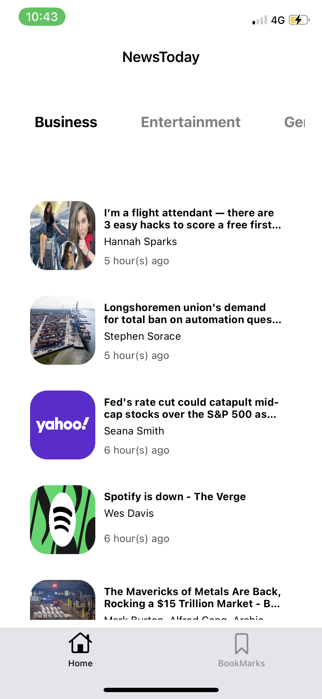

**NewsToday App**

This is a NewsToday iOS newsfeed and top headlines app written in Swift and based on NewsAPI.

---

## About

News Feed Site:  https://newsapi.org. 

Used API : https://newsapi.org/v2/top-headlines?country=us&category=(*****)&apiKey=(*****)"
(We have to creat api key from https://newsapi.org)

---

## Design

1. MVVM architecture
2. Storyboard based

---

## Interface

<pre>
           

           

 
</pre>

